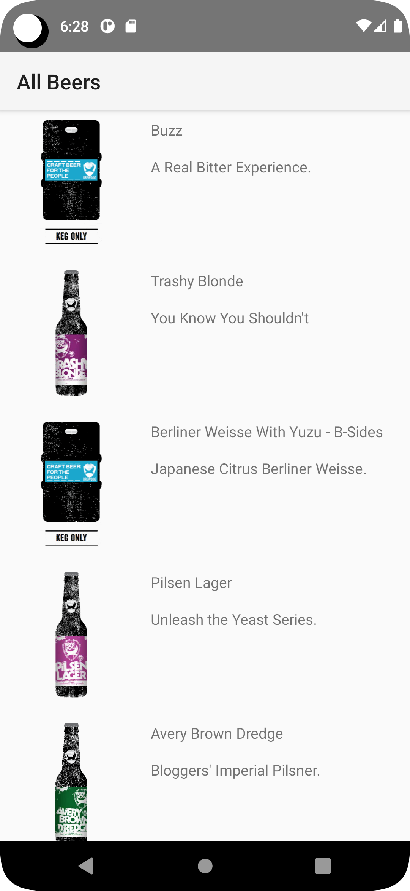
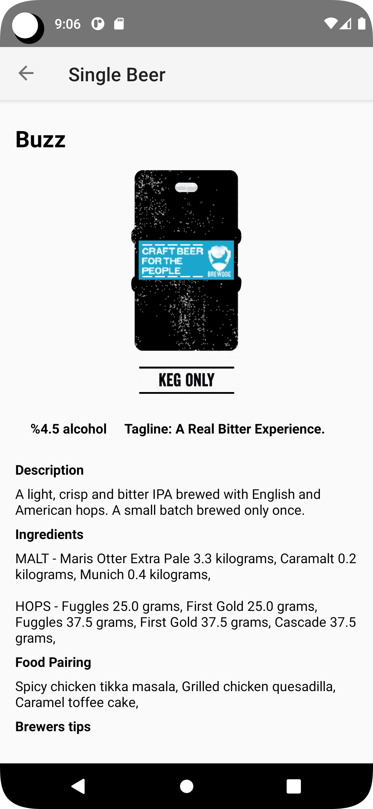

# Hoppy Hour

Hi, Do you want to grab some?

Hoppy Hour is an Android App that displays beer data from Punk API.

## Punk Api Documentation
[Punk Api V2 Documentation](https://punkapi.com/documentation/v2)

# Description

I built this app using with Kotlin and implementing Clean Architecture, Coroutines, Data Binding, and Dependency Injection. It displays four screens as shown in the sketch below.

### Screens

 <table>
  <tr>
    <td>Splash Screen</td>
    <td>On Boarding Screen</td>
     <td>List of Beers</td>
     <td> Single Beer Details Screen</td>

  </tr>
  <tr>
    <td></td>
    <td></td>
    <td></td>
    <td></td>

  </tr>
 </table>

## Requirements
*   [Android Studio 3.0](https://developer.android.com/studio) and above.
*   [Android buildToolsVersion 29.0.3](https://developer.android.com/studio/releases/build-tools) and above.
*   Android minSdkVersion 19.
*   Kotlin version 1.3.*. 

## Features & Libraries
* Implementation of android  Clean Architecture
* Display list with RecycleView and data binding with  Paging Library.
* Managing of asynchronous calls using  Kotlin Coroutines.
* View-Binding: Accessing xml views
* HTTP logging interceptors: Log HTTP requests.
* Glide: Image processing
* Paging3: Pagination
* Datastore:Key values
* Hilt: Dependency Injection framework 
* ViewModel: MVVM pattern component 
* Kotlin-Coroutines-Flow: For asynchronous tasks, reactive programming 
* Android Jetpack Navigation: Screen navigation 
* Retrofit: REST Api client & HTTP requests
* Room: SQL database storage library & Caching

## Support and contact details
Email: josphatmwania237@gmail.com
# License
MIT  [LICENSE](LICENSE) Josphat Mwania 2023